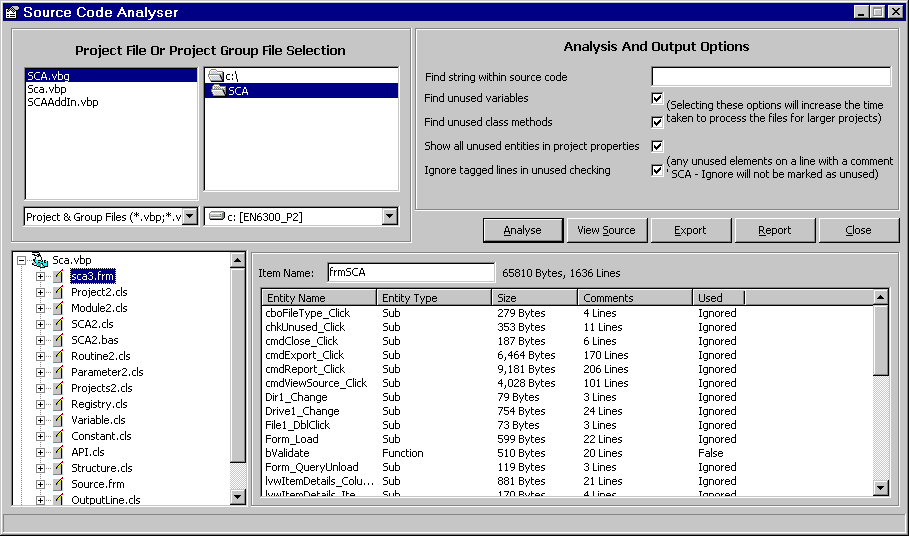



## VB Source Code Analyser \* UPDATED \*

### Description

Anaylse your Visual Basic source code, improve it by identifying unused variables, constants or routines.

Works either by project or project group. Provides basic file and project statistics

Can be run either as an Add-In or via a standalone executable.

Any ideas for improvement? Any problems? Please let me know what you think.
 
### More Info
 

             |
---                |---
**Submitted On**   |2003-07-01 12:18:06
**By**             |[Tim Watts](https://github.com/Planet-Source-Code/PSCIndex/blob/master/ByAuthor/tim-watts.md)
**Level**          |Advanced
**User Rating**    |4.7 (80 globes from 17 users)
**Compatibility**  |VB 4\.0 \(32\-bit\), VB 5\.0, VB 6\.0
**Category**       |[VB function enhancement](https://github.com/Planet-Source-Code/PSCIndex/blob/master/ByCategory/vb-function-enhancement__1-25.md)
**World**          |[Visual Basic](https://github.com/Planet-Source-Code/PSCIndex/blob/master/ByWorld/visual-basic.md)
**Archive File**   |[VB\_Source\_160871722003\.zip](https://github.com/Planet-Source-Code/tim-watts-vb-source-code-analyser-updated__1-46561/archive/master.zip)

